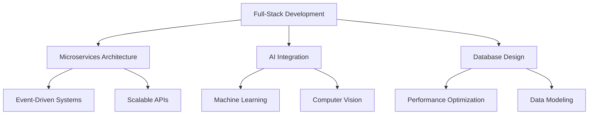

	

	
	
	

---

  
### 🚀 **Full-Stack Developer | Problem Solver | Microservices Architect**

_I love building intelligent systems, scalable backends, and engaging frontends._  
_My work blends creativity with precision — whether it's crafting microservices, optimizing algorithms, or designing intuitive UIs._

---

## 📊 GitHub Analytics

  
  

  

  

---

## 🏆 GitHub Trophies

  

---

## 🔧 Tech Stack

### **Languages**

### **Frontend Development**

### **Backend & APIs**

### **Databases**

### **DevOps & Tools**

---

## 📌 Featured Projects

  
<table>
<tr>
<td width="50%">

### 🎓 Collaborative Learning Platform

**Personalized Study Plans & AI Integration**

- Collaborative document editing
- Resource sharing system
- AI-powered document querying
- Microservice architecture
- Real-time collaboration

</td>
<td width="50%">

### 🏫 AI-Driven Management System

**Student & Faculty Management**

- Facial recognition attendance
- Microservice architecture
- Real-time scheduling
- Advanced analytics
- Automated reporting

</td>
</tr>
<tr>
<td width="50%">

### 🛒 E-Commerce Platform

**Single Vendor Solution**

- JWT authentication
- Dynamic product variants
- Shopping cart system
- Order management
- Payment integration

</td>
<td width="50%">

### 🏏 Fantasy Cricket League

**AI-Powered Team Selection**

- Live statistics tracking
- Dynamic leaderboards
- AI team recommendations
- Built in 36 hours!
- Real-time updates

</td>
</tr>
</table>

---

## 📈 Coding Activity

  

---

## 🎯 What I Do Best

### 🌟 Core Competencies

- 🏗️ **Microservices Architecture** - Expert in event-driven design and distributed systems
- 🔧 **Full-Stack Solutions** - Building complete applications from database to frontend
- 🧠 **AI Integration** - Implementing machine learning and computer vision solutions
- ⚡ **Performance Optimization** - Algorithm optimization and system efficiency
- 🔨 **Problem Solving** - From algorithmic challenges to enterprise-scale solutions
- 💻 **Versatile Coding** - Hardware-level programming to high-level application development

---

## 🎮 GitHub Metrics

  

---

## 📫 Let's Connect

**Looking for collaboration opportunities or want to discuss tech?**  
_I'm always excited to connect with fellow developers and work on innovative projects!_

---

  

---

  
> 💡 *"Building systems is like solving puzzles — every piece matters, but the magic happens when they all fit together."*

**⭐ If you find my work interesting, consider giving a star to my repositories!**

  

